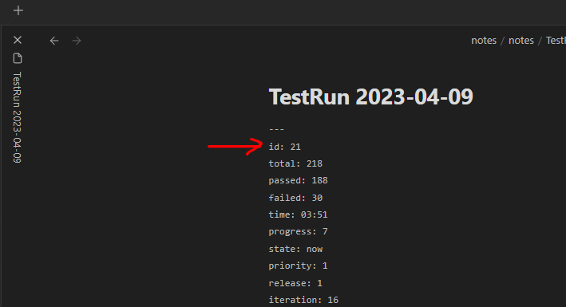
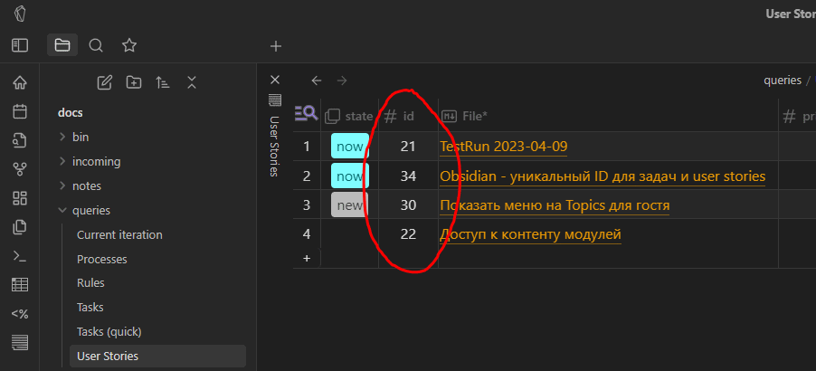

# Obsidian Unique ID Plugin

This is a plugin for Obsidian (https://obsidian.md). It add 'id' meta item in any newly created note. ID will be incremented next time. So each document could be addressed by unique id now.

# How to use

1. Install and activate plugin
2. Create the new note
2. Verify meta-date. It should contains the unique ID

# Bonus

You could use https://github.com/RafaelGB/obsidian-db-folder to get Azure/Jira-like project management system

